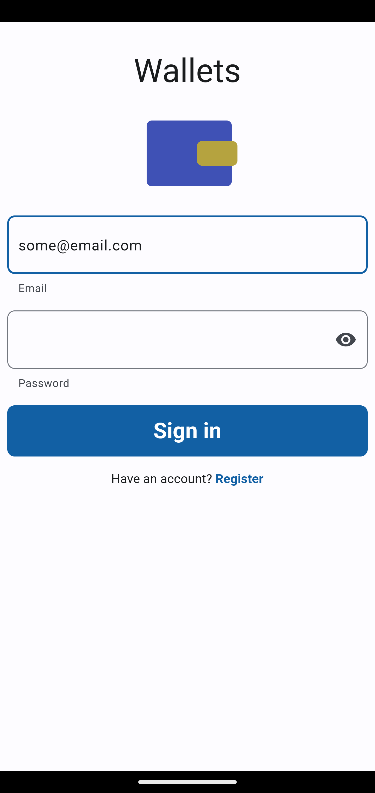
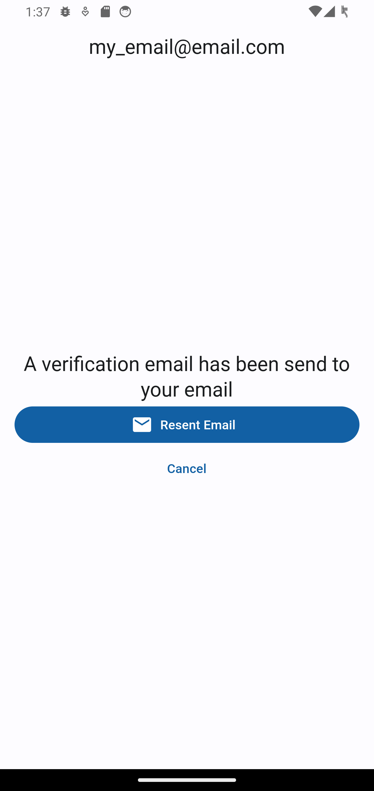
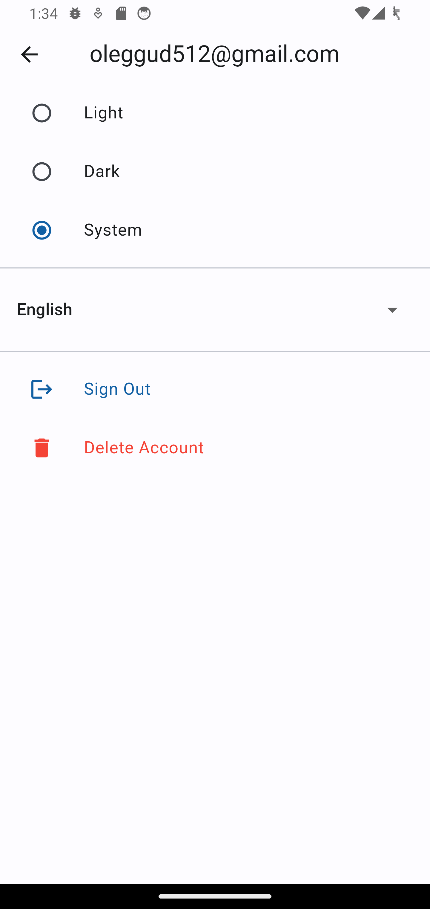

# Wallets

A basic and easy-to-use personal finance tracking app.

## Overview
### Main page

#### Add new wallet

#### Change the wallet description or remove the wallet

### Transaction
You can take and add funds to your wallet. Then you can see that the transaction appeared in history.

### Signing in / Registration

#### Email verification

### Settings

You can download the app from [Play Store](https://play.google.com/store/apps/details?id=com.sandgars.ads_pay_app).
